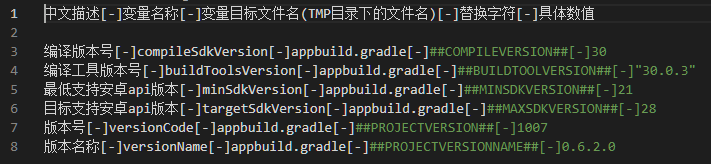
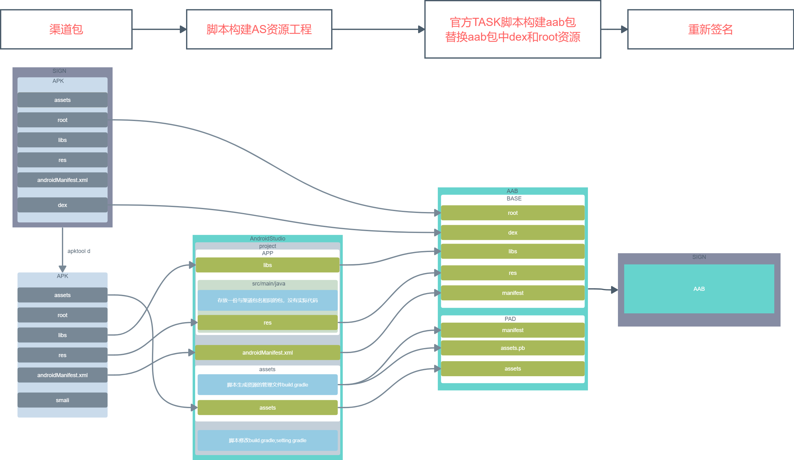

# **APK2AAB**

>### 将APK转换成AAB的工具

>### 1.环境准备：  
&emsp;&emsp;1.1 必须至少连接maven下载必要支持库  
&emsp;&emsp;1.2 本地需要有java环境，并把jdk/lib/tools.jar复制到jre/lib/下  
&emsp;&emsp;1.3 本地需要有android-sdk环境，并把目录写入local.properties中，目录中反斜杠前需要额外加一个反斜杠来转义  
&emsp;&emsp;1.4	本地需要有python3.7及以上的环境，命令行中使用python –version查看本地python环境  

>### 2.工具使用：  

>&emsp;&emsp;2.1 进入APK2AAB/TMP/config.ini对本次转换编译版本进行配置  

&emsp;&emsp;  
&emsp;&emsp;&emsp; 每个需要配置的参数占一行，配置项使用[-]进行分割，  
&emsp;&emsp;&emsp; 仅需编译版本，编译工具版本两项配置最后一个参数即可，  
&emsp;&emsp;&emsp; 编译工具版本号需要带双引号  
&emsp;&emsp;&emsp; 其余参数目前会动态读取解包后apktool.yml文件中的参数不需要修改，不能删除  

>&emsp;&emsp;2.2 手动调用命令方式  

&emsp;&emsp;&emsp; Python creatAAB.py的绝对路径 --apkfile=apk包绝对路径  
&emsp;&emsp;&emsp; 成功执行后会在apk包同目录下生成同名aab文件  

>&emsp;&emsp;2.3 手动重置工具方式  

&emsp;&emsp;&emsp; Python cleanRoot.py 绝对路径  

>&emsp;&emsp;2.4 常见错误及处理方式  

&emsp;&emsp;&emsp; 执行python creatAAB.py后命令行中会打印当前进行流程的日志  
&emsp;&emsp;&emsp; 每条流程日志使用=>开头

>&emsp;&emsp; 一些错误示例及解决办法
~~~
Error:Execution failed for task ':app:compileReleaseJavaWithJavac'. 
> Compilation failed; 
see the compiler error output for details.
~~~
&emsp;&emsp;&emsp; 出现:app:compileReleaseJavaWithJavac  
&emsp;&emsp;&emsp; 原因:找不到tool.jar  
&emsp;&emsp;&emsp; 处理:需要将jdk中的tools.jar复制到jre/lib/下  

&emsp;&emsp;&emsp; 出现：[xxx/xxx/xx目录不为空]  
&emsp;&emsp;&emsp; 原因：该目录下文件名长度超过windows限制，需要手动删除这个目录并重新构建，这个问题常见于win7  
&emsp;&emsp;&emsp; 处理：手动删除这个报错的目录  
&emsp;&emsp;&emsp; 备注：工具中可以改动/删除的内容，（assets/src/main/assets/下所有文件）（app/libs/下所有）（app/src/main/res/下所有）（app/build/outputs/bundle/release/下所有）  

&emsp;&emsp;&emsp; 出现：=>run task to build bundlerelease is beginning后进行了长时间等待没有后续步骤  
&emsp;&emsp;&emsp; 原因：说明打包时间因为下载所需内容的原因，超出了脚本设定的超时限制  
&emsp;&emsp;&emsp; 处理：关掉当前命令行窗口，重新进行一次转aab，第二次转换会很快  

&emsp;&emsp;&emsp; 出现：=>run task to build bundlerelease end  
&emsp;&emsp;&emsp; 原因：使用gradle执行task编aab包失败，原因复杂  
&emsp;&emsp;&emsp; 处理：请提供命令行中的日志进行分析  

>&emsp;&emsp; 正常流程：
~~~
=>run task to build bundlerelease is beginning
BUILD SUCCESSFUL in 5s
=>run task to build bundlerelease end
begin to sign：D:\APK2AAB/game_0.6.2.0.aab
=>end with build success
~~~

## **原理描述**
